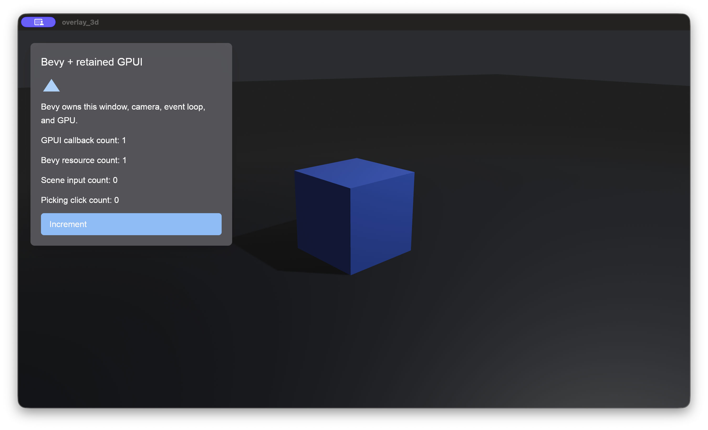

# `bevy_gpui`

Retained [GPUI Community Edition](https://github.com/gpui-ce/gpui-ce) views
inside ordinary [Bevy 0.19](https://bevyengine.org/) applications.

Bevy keeps ownership of the runner, event loop, native windows, cameras,
renderer, GPU, command submission, and presentation. GPUI handles retained
layout, painting, focus, and interaction, then records into Bevy camera targets.



## Status

This package is still in development and experimental. It's been lightly tested & demoed on macos but not yet on Linux / Windows. This was mainly a test to see how far gpt 5.6-sol could go.

Read [Compatibility and limitations](docs/compatibility.md) before adopting the
crate in a production application.

## Install

```toml
[dependencies]
bevy = "0.19"
bevy_gpui = { path = "../bevy_gpui" }
```

The integration is not yet present on a committed remote branch or package
release. Point `path` at this checkout. After a commit or tag containing the
0.1.0 integration is published, replace the path with an exact Git `rev`.

The default features enable rendering, Bevy picking integration, font-kit,
Wayland, X11, and the Windows manifest support used by GPUI. See the
[feature reference](docs/reference.md#cargo-features) for custom builds.

## First overlay

```rust
use bevy::prelude::*;
use bevy_gpui::{
    GpuiContexts, GpuiPlugin,
    gpui::{Context, IntoElement, Render, Window, div, prelude::*, rgb, rgba},
};

fn main() {
    App::new()
        .add_plugins((DefaultPlugins, GpuiPlugin::default()))
        .add_systems(Startup, setup)
        .run();
}

fn setup(mut commands: Commands, mut gpui: GpuiContexts) {
    let camera = commands.spawn(Camera2d).id();
    gpui.set_root(camera, |_, cx| cx.new(|_| WelcomePanel { clicks: 0 }))
        .expect("GPUI root should be queued");
}

struct WelcomePanel {
    clicks: u32,
}

impl Render for WelcomePanel {
    fn render(&mut self, _: &mut Window, cx: &mut Context<Self>) -> impl IntoElement {
        div().size_full().p_8().child(
            div()
                .w_96()
                .p_5()
                .rounded_lg()
                .bg(rgba(0x18_18_1b_e8))
                .text_color(rgb(0xf4_f4_f5))
                .child(div().text_xl().child("Hello from GPUI"))
                .child(format!("Button clicks: {}", self.clicks))
                .child(
                    div()
                        .id("increment")
                        .mt_3()
                        .px_4()
                        .py_2()
                        .rounded_md()
                        .bg(rgb(0x25_63_eb))
                        .cursor_pointer()
                        .child("Increment")
                        .on_click(cx.listener(|view, _, _, cx| {
                            view.clicks += 1;
                            cx.notify();
                        })),
                ),
        )
    }
}
```

In an application project, save that source as `src/main.rs` and run:

```bash
cargo run
```

From this repository checkout, run the checked example directly:

```bash
cargo run --example getting_started
```

The [getting-started tutorial](docs/getting-started.md) explains each boundary
and shows how to keep a typed root handle for later synchronization.

## What it supports

- 2D and 3D camera overlays, viewports, and render ordering around Bevy UI.
- Multiple Bevy windows and camera-bound retained roots.
- Bevy `Image` render targets and prepared Bevy images painted inside GPUI.
- SDR and `Rgba16Float` HDR targets.
- Mouse, wheel, keyboard, modifiers, text, IME, focus, and file drop. Pinch is
  limited to a single active window/context because Bevy's gesture has no
  window ID.
- Deferred GPUI-to-Bevy commands/messages and typed Bevy-to-GPUI updates.
- Aggregate gameplay input claims, polling run conditions, and an automatic
  window-wide Bevy picking blocker.
- Reactive event-loop wakeups, pipelined scene extraction, and render-device
  recovery.
- Full-target backdrop/content filters. Filtered cropped viewports log an error
  and skip that GPUI scene.

## Input correctness

Bevy input messages are broadcast. Gameplay systems with raw message readers
must run after `GpuiSystems::Input`, always drain their readers, and ignore
behavior while `GpuiInputState` claims that input. The public run conditions are
for polling systems without message cursors. The default `picking` feature
separately blocks lower Bevy picking hits while GPUI owns the pointer.

Follow [How to route input and Bevy picking](docs/how-to-input-and-picking.md)
before combining interactive overlays with scene controls.

## Examples

```bash
cargo run --example getting_started
cargo run --example overlay_3d
cargo run --example text_input
cargo run --example multi_window
cargo run --example render_to_texture
cargo run --example lifecycle
cargo run --example hdr_overlay
```

The [documentation index](docs/README.md#runnable-examples) maps every example
to the behavior to inspect.

## Documentation

- [Getting started](docs/getting-started.md)
- [How-to guides](docs/README.md#how-to-guides)
- [Public API reference](docs/reference.md)
- [Architecture](docs/architecture.md)
- [Compatibility and limitations](docs/compatibility.md)
- [Future work](docs/future-work.md)
- [Troubleshooting](docs/troubleshooting.md)
- [Contributing](CONTRIBUTING.md)
- [Maintainer guide](docs/maintainers.md)

## Learn GPUI

`bevy_gpui` embeds GPUI but does not replace GPUI's retained-view concepts.
Learn `Render`, `Context`, elements, styling, listeners, focus, and async tasks
from the pinned revision's
[learning examples](https://github.com/gpui-ce/gpui-ce/tree/20340e14874a3b55122e5cb2aa0d023874e08b2d/crates/gpui/examples/learn).
Import those APIs through `bevy_gpui::gpui` so your application uses the same
revision as the bridge.

The original [integration specification](docs/integration-spec.md) records the
research, ownership decision, implementation phases, and acceptance matrix.

## Vendored GPUI revision

The repository vendors one exact upstream GPUI revision because the integration
needs host-neutral APIs that upstream did not expose at that point. The patch
surface and provenance are recorded in
[`vendor/gpui-ce/BEVY_GPUI_PATCH.md`](vendor/gpui-ce/BEVY_GPUI_PATCH.md).

Use `bevy_gpui::gpui` for GPUI imports so application code uses the same types
as the integration.

## License

`bevy_gpui` is available under the [MIT License](LICENSE). Vendored GPUI source
retains its upstream license and provenance.
