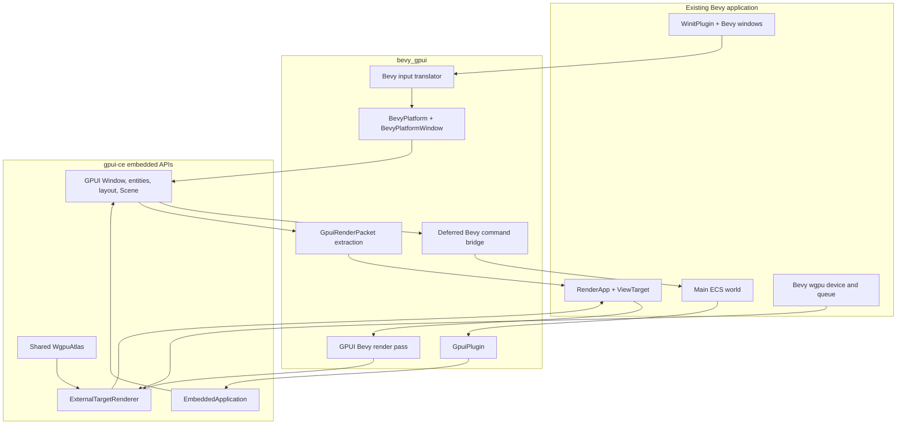
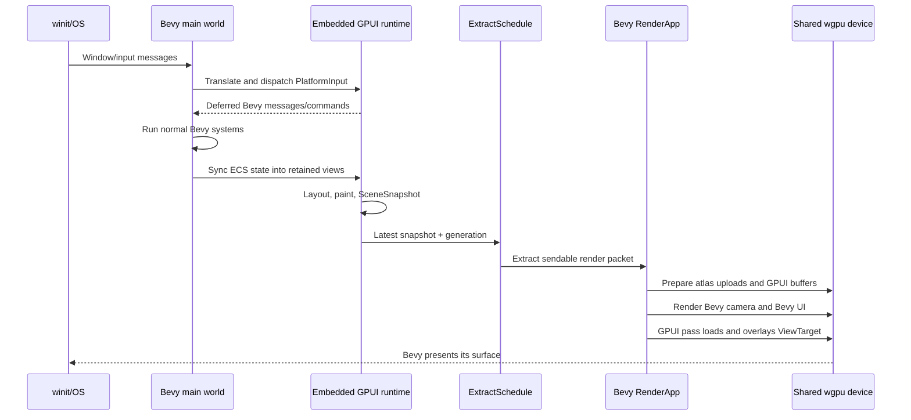

# Bevy ↔ GPUI integration specification

- Status: implemented core architecture; explicit parity limitations in section 19
- Target: Bevy 0.19 and `gpui-ce/gpui-ce` main
- Researched GPUI revision: `20340e14874a3b55122e5cb2aa0d023874e08b2d`
- Last updated: 2026-07-10

> [!WARNING]
> **Historical design record.** Sections 1 through 18 preserve the proposal,
> pseudocode, target layout, phased gates, and recommendation used before the
> current implementation existed. They are not current installation,
> validation, dependency, or maintenance instructions. Some proposed names and
> type shapes intentionally differ from the shipped code. For current behavior,
> use the [public API reference](reference.md), [architecture](architecture.md),
> [compatibility page](compatibility.md), and [maintainer guide](maintainers.md).

## 1. Objective

Build a `bevy_gpui` plugin that can be added to an ordinary Bevy application
without replacing Bevy's runner, window implementation, renderer, or schedules.

The minimum integration shape must be:

```rust
App::new()
    .add_plugins(DefaultPlugins)
    .add_plugins(GpuiPlugin::default())
    .add_systems(Startup, setup_gpui)
    .run();
```

An existing Bevy camera must continue to render while GPUI draws an interactive
overlay into the same Bevy-managed render target.

## 2. Non-negotiable invariants

1. **Bevy owns the process event loop.** `WinitPlugin` remains installed and its
   runner is not replaced.
2. **Bevy owns native windows and presentation.** GPUI must not create a second
   native window or `wgpu::Surface` for a Bevy window.
3. **Bevy owns the GPU.** GPUI uses Bevy's existing `wgpu::Device`, `Queue`,
   command encoder, and view target. There is one adapter/device/queue stack.
4. **GPUI remains retained-mode GPUI.** We do not translate GPUI widgets into
   `bevy_ui` nodes or reimplement GPUI layout and interaction semantics.
5. **Normal Bevy rendering remains valid.** 2D, 3D, HDR, multiple cameras,
   multiple windows, render-to-texture, and pipelined rendering must have an
   explicit supported behavior.
6. **No live `World` reference enters a GPUI callback.** Cross-framework writes
   are deferred through a command/message bridge to avoid ECS aliasing and
   retained callback lifetime hazards.
7. **No CPU framebuffer readback in the steady-state render path.** GPUI is
   rendered directly by the shared GPU device.

The existing runner-based prototype violates invariants 1 through 3 and is not
the implementation base for this specification.

## 3. Evidence from the current codebases

### 3.1 Bevy already owns all host responsibilities

- Bevy 0.19 `WinitPlugin::build` installs `winit_runner` with `App::set_runner`.
- Bevy converts native window input into entity-addressed messages such as
  `KeyboardInput`, `MouseButtonInput`, `CursorMoved`, `MouseWheel`, `Ime`, and
  window resize/focus messages.
- Bevy's `RenderApp` exposes an `ExtractSchedule`, prepare/queue stages, camera
  render schedules, and a `RenderContext` with access to its command encoder.
- `ViewTarget` exposes the current camera color attachment and texture views.

This means `bevy_gpui` should integrate through Bevy's render and input
subsystems, not introduce another application runner.

### 3.2 GPUI exposes most CPU-side host seams

At GPUI revision `20340e1`:

- `Application::with_platform` accepts a caller-provided `Platform`.
- `Platform` and `PlatformWindow` are public traits.
- `PlatformWindow` accepts input callbacks and receives a completed `Scene` in
  `draw(&Scene)`.
- `PlatformInput` publicly represents mouse, key, scroll, pinch, and file-drop
  events.
- `PlatformInputHandler` publicly exposes text selection, replacement, marked
  text, and IME-related operations.
- `Scene` and its render primitives are public enough for a renderer, and
  `Scene::batches()` exposes ordered primitive batches.
- `gpui_wgpu::WgpuAtlas` can be constructed from a device and queue.

These seams are sufficient to write a Bevy-backed platform/window adapter after
the missing lifecycle and renderer seams below are added.

### 3.3 GPUI is not currently embeddable without changes

Two upstream limitations block a correct plugin:

1. `Application::run` consumes the application and assumes `Platform::run`
   remains active for the application lifetime. There is no supported
   non-blocking embedded application handle that a Bevy resource can retain and
   update.
2. `gpui_wgpu::WgpuRenderer` constructs and configures a `wgpu::Surface` and
   acquires/presents surface textures inside `draw(&Scene)`. It cannot record a
   GPUI scene into a host-provided `TextureView` and `CommandEncoder`.

There is also a dependency-identity issue: GPUI main pins a Zed fork of
`wgpu` revision `357a0c56e0070480ad9daea5d2eaa83150b79e88`, while Bevy 0.19
depends on crates.io `wgpu 29.0.3`. Even though both report version 29.0.3,
Cargo treats different sources as different Rust types.

## 4. Architectural decision

Split the work into a host-neutral embedded layer in GPUI and a Bevy-specific
adapter in this repository.



The host-neutral GPUI changes should be proposed upstream. Until they are
accepted and released, `bevy_gpui` should pin a reviewed GPUI revision that
contains them. The Bevy plugin must not reach into GPUI private fields.

## 5. Required changes in gpui-ce

### 5.1 Embedded application lifetime

Add a supported non-blocking lifecycle alongside `Application::run`:

```rust
pub struct EmbeddedApplication {
    // Strong ownership of GPUI's AppCell; exact field remains private.
}

impl Application {
    pub fn start_embedded(
        self,
        on_start: impl FnOnce(&mut App) + 'static,
    ) -> EmbeddedApplication;
}

impl EmbeddedApplication {
    pub fn update<R>(&self, f: impl FnOnce(&mut App) -> R) -> Result<R>;
    pub fn foreground_executor(&self) -> ForegroundExecutor;
    pub fn shutdown(self);
}
```

Requirements:

- It retains the strong application allocation without entering
  `Platform::run`.
- It may only be created and updated on the platform's main thread.
- It performs the same launch initialization as `Application::run`.
- It has an explicit shutdown path that releases windows, entities, and tasks.
- Borrow conflicts are reported, not hidden with unsafe reentrancy.

An `Application: Clone` patch is insufficient as the public contract: it would
keep the allocation alive but would not define launch, update, reentrancy, or
shutdown semantics.

### 5.2 External-target WGPU renderer

Split the current surface-owning renderer into two layers:

```rust
pub struct SceneRenderer {
    // pipelines, buffers, samplers, atlas and intermediate textures
}

pub struct ExternalRenderTarget<'a> {
    pub encoder: &'a mut wgpu::CommandEncoder,
    pub color: &'a wgpu::TextureView,
    pub format: wgpu::TextureFormat,
    pub size: Size<DevicePixels>,
    pub load: wgpu::LoadOp<wgpu::Color>,
    pub alpha_mode: ExternalAlphaMode,
}

impl SceneRenderer {
    pub fn from_external_device(
        device: wgpu::Device,
        queue: wgpu::Queue,
        atlas: Arc<WgpuAtlas>,
    ) -> anyhow::Result<Self>;

    pub fn render(
        &mut self,
        scene: &Scene,
        target: ExternalRenderTarget<'_>,
    ) -> anyhow::Result<()>;
}
```

The exact ownership types may use `Arc`; the behavioral requirements are:

- Never create, configure, acquire, or present a surface.
- Never create a second adapter or device.
- Never submit the host's command encoder. Bevy owns submission.
- Key pipelines by target format, alpha behavior, and sample count.
- Support `LoadOp::Load` so GPUI overlays an existing camera result.
- Resize intermediate path/blur textures when the host target changes.
- Keep the existing surface renderer as a wrapper around `SceneRenderer` so
  normal GPUI applications retain current behavior.

### 5.3 Sendable render snapshot

Add an explicit render-transfer type:

```rust
pub struct SceneSnapshot {
    // Ordered, renderer-ready primitive vectors and referenced atlas IDs.
}

impl Scene {
    pub fn snapshot(&self) -> SceneSnapshot;
}
```

`SceneSnapshot` must be `Send + Sync + 'static` so it can cross Bevy's
pipelined-rendering boundary. It must not contain platform-native window,
surface, or main-thread objects.

GPUI's current platform-specific `PaintSurface` representation needs to become
an opaque external texture/surface ID plus a renderer-provided lookup. This is
required for zero-copy Bevy `Image` support and for Windows parity.

### 5.4 WGPU source unification

The spike must make Bevy and GPUI resolve one `wgpu` package identity.

Preferred order:

1. Change the integration GPUI branch to upstream crates.io `wgpu = 29.0.3` and
   prove GPUI's renderer tests still pass.
2. If GPUI requires Zed-only WGPU patches, patch Bevy's crates.io dependency to
   the exact same Zed revision and run Bevy's renderer examples on all desktop
   backends.

Shipping two WGPU package identities and copying raw handles between them is not
acceptable.

## 6. `bevy_gpui` crate design

### 6.1 Plugin contract

```rust
pub struct GpuiPlugin {
    pub render_order: GpuiRenderOrder,
    pub auto_attach_primary: bool,
    pub accessibility: GpuiAccessibility,
}

pub enum GpuiRenderOrder {
    BelowBevyUi,
    AboveBevyUi,
}
```

`GpuiPlugin::build` must:

- Assert that `WinitPlugin`, `WindowPlugin`, and `RenderPlugin` are available
  when their associated features are enabled.
- Leave the current Bevy runner untouched.
- Install the embedded GPUI runtime as a `NonSend` resource.
- Install input, window synchronization, executor-driving, scene production,
  extraction, preparation, and render-pass systems.
- Register a render pass in both `Core2d` and `Core3d`, ordered relative to
  Bevy UI according to `render_order`.
- Support a no-render feature for state/input tests without `RenderApp`.

### 6.2 Public application API

The retained-mode API should expose typed, Bevy-safe handles rather than direct
access to a `RefCell<bevy_app::App>`:

```rust
fn setup_gpui(
    mut gpui: GpuiContexts,
    camera: Single<Entity, With<PrimaryGpuiCamera>>,
    mut commands: Commands,
) {
    let root = gpui.set_root(*camera, |_window, cx| {
        cx.new(|cx| EditorView::new(cx))
    })?;
    commands.insert_resource(EditorRoot(root));
}

fn sync_gpui(
    score: Res<Score>,
    root: Res<EditorRoot>,
    mut gpui: GpuiContexts,
) {
    gpui.update(&root.0, |view, _window, cx| {
        view.score = score.value;
        cx.notify();
    })?;
}
```

Proposed types:

- `GpuiContexts<'w, 's>`: a main-thread `SystemParam` over the embedded runtime.
- `GpuiViewHandle<V>`: a `Send + Sync` typed numeric token. The real GPUI
  `Entity<V>` stays inside the non-send runtime.
- `GpuiContext` component: associates one GPUI root and scene with a camera or
  normalized render target.
- `PrimaryGpuiContext`: marker used by `GpuiContexts::primary` helpers.
- `GpuiInputState`: Bevy resource reporting `wants_pointer_input`,
  `wants_keyboard_input`, and the last dispatch result.

`GpuiContexts` methods must validate stale handles and wrong view types with
errors rather than panics.

### 6.3 GPUI callbacks to Bevy

GPUI callbacks are retained and may execute while the GPUI runtime is borrowed.
They must not capture or dereference a Bevy `World` pointer.

Install a GPUI global backed by a thread-safe deferred queue:

```rust
pub trait BevyAppContextExt {
    fn send_bevy_message<M: Message>(&mut self, message: M);
    fn queue_bevy_command<C: Command>(&mut self, command: C);
}
```

The input bridge drains and applies this queue after GPUI event dispatch and
before ordinary `Update` systems. Commands emitted during rendering are applied
at the next safe main-world boundary.

This gives GPUI callbacks ergonomic writes while preserving Bevy's aliasing and
scheduler rules. Reads flow in the other direction through ordinary Bevy sync
systems calling `GpuiContexts::update`.

## 7. Embedded platform adapter

### 7.1 `BevyPlatform`

Implement GPUI's `Platform` without owning a native loop:

- `run`: unused by `EmbeddedApplication`; calling it is an error.
- `open_window`: create a `BevyPlatformWindow` bound to a Bevy window/camera
  context, never a native window.
- `quit`: enqueue Bevy `AppExit`.
- display/window queries: use synchronized snapshots of Bevy window and monitor
  state.
- cursor, title, visibility, size, fullscreen, and IME writes: enqueue mutations
  of Bevy `Window`/`CursorOptions` components.
- clipboard and URL opening: use small host services with platform-independent
  implementations; do not start GPUI's native platform loop.
- text system: use GPUI's platform text implementation or `CosmicTextSystem`
  without creating another windowing platform.

### 7.2 `BevyPlatformWindow`

Each adapter window contains:

- the Bevy window entity and associated camera/context entity;
- a synchronized window state snapshot (bounds, scale, focus, modifiers,
  pointer position and appearance);
- GPUI callbacks registered by `Window::new`;
- a shared `WgpuAtlas`;
- the latest `SceneSnapshot` and monotonically increasing scene generation;
- an output command queue for cursor/title/IME/window operations.

`draw(&Scene)` snapshots the scene; it does not render or present. The actual
render happens in `RenderApp`.

The plugin invokes the registered request-frame callback once when a GPUI view
is dirty, a GPUI animation/timer requests another frame, the Bevy target
resizes, or a Bevy redraw is otherwise required. It must not blindly redraw at
60 Hz when both frameworks are idle.

### 7.3 GPUI dispatcher

Implement `PlatformDispatcher` with:

- a main-thread runnable queue drained in `GpuiSystems::DriveExecutor`;
- Bevy task pools for background work;
- a deadline queue for `dispatch_after`;
- event-loop wakeups through Bevy's `EventLoopProxyWrapper` when the app is in
  reactive/low-power update mode;
- bounded runnable processing per frame to prevent an async task storm from
  starving Bevy schedules.

The dispatcher records the creating thread and rejects main-thread work from an
incorrect thread.

## 8. Input and window event bridge

Translate entity-addressed Bevy messages into `PlatformInput` before ordinary
gameplay systems that opt into GPUI input gating.

| Bevy input | GPUI input/action |
|---|---|
| `CursorMoved` | `MouseMoveEvent` |
| `MouseButtonInput` press/release | `MouseDownEvent` / `MouseUpEvent` |
| `MouseWheel` | `ScrollWheelEvent` preserving pixel/line units |
| `KeyboardInput` | `KeyDownEvent` / `KeyUpEvent` plus text dispatch |
| modifier resources/messages | `ModifiersChangedEvent` |
| `PinchGesture` | `PinchEvent` |
| `FileDragAndDrop` | `FileDropEvent` |
| `WindowFocused` | active-status callback |
| resize/scale messages | resize callback and forced scene regeneration |
| `Ime::Preedit` | marked-text replacement through `PlatformInputHandler` |
| `Ime::Commit` | committed text replacement through `PlatformInputHandler` |

Additional rules:

- Track click count by window, button, time, and distance; Bevy's button message
  does not carry GPUI's click count.
- Map logical Bevy keys to GPUI key names and preserve physical key identity
  where GPUI keybindings need it. Test the mapping table exhaustively.
- Translate coordinates into the GPUI context's camera viewport, including DPI
  and viewport offsets.
- Store GPUI's `DispatchEventResult`. `default_prevented` and focused text input
  update `GpuiInputState`.
- Bevy message readers cannot erase events already published by Bevy. Provide
  run conditions (`gpui_wants_pointer_input` and
  `gpui_wants_keyboard_input`) and optional picking integration rather than
  claiming global event consumption.
- Cursor changes are applied through Bevy's cursor component/plugin.

Touch/mobile support is not implied by mouse emulation. GPUI main currently has
no complete public touch `PlatformInput` variant, so native touch requires an
upstream GPUI event model extension before mobile can be declared supported.

## 9. Frame and render data flow



### 9.1 Main-world schedule

Define public system sets:

1. `GpuiSystems::DriveExecutor`
2. `GpuiSystems::Input`
3. `GpuiSystems::ApplyDeferredBridge`
4. ordinary Bevy `Update`
5. `GpuiSystems::WindowSync`
6. `GpuiSystems::BuildScene` in `PostUpdate`

Only build a new scene when a view/window is dirty or a frame callback requests
presentation. Preserve the last complete scene for render pipelining.

### 9.2 Render-world schedule

- `ExtractSchedule`: clone/move the latest `SceneSnapshot`, context target,
  viewport, scale factor, and generation into render entities.
- `RenderSystems::Prepare`: create/specialize external renderers and resize
  intermediate textures.
- `RenderSystems::PrepareResources`: flush atlas uploads and stage primitive
  buffers.
- `Core2d`/`Core3d`: render after the selected Bevy main/UI pass and before
  upscaling/presentation.

The pass uses `ViewTarget::get_unsampled_color_attachment()` with load semantics
for ordinary overlays. Post-processing effects that need to sample existing
color use `ViewTarget::post_process_write()` and GPUI-owned intermediate
textures.

## 10. Textures, images, filters, and color

### 10.1 GPUI atlas

Create one shared `Arc<WgpuAtlas>` per Bevy render device. GPUI's main-thread
paint phase may allocate atlas tiles; pending uploads are flushed in the render
world before the GPUI pass.

The device and queue must be cloned from Bevy after WGPU source unification.
Atlas cache invalidation must follow Bevy renderer/device lifecycle.

### 10.2 Bevy images inside GPUI

Add an external texture registry keyed by stable IDs:

```rust
pub struct GpuiBevyImage(pub Handle<Image>);
```

Extraction resolves the handle to Bevy's `GpuImage`; the external GPUI renderer
binds that texture directly. Missing or not-yet-prepared images render a
deterministic placeholder and request another frame. No image readback is
allowed.

### 10.3 GPUI surfaces inside the scene

Replace platform-specific `PaintSurface` payloads with host-neutral external
surface IDs. Bevy can then register camera textures, video textures, or custom
texture views without embedding backend-specific objects in `SceneSnapshot`.

### 10.4 HDR and alpha

- Specialize pipelines for `Rgba8UnormSrgb`, non-sRGB swapchain formats, and
  `Rgba16Float` HDR camera targets.
- Define conversion of GPUI's sRGB colors into the target compositing space.
- Preserve premultiplied-alpha blending.
- Add screenshot tests for SDR, HDR, transparent windows, and non-1.0 scale.

### 10.5 Backdrop and content filters

GPUI blur filters require already-painted scene color. The external renderer
must copy or ping-pong the Bevy `ViewTarget` through its intermediate textures
without acquiring a surface. If this is not implemented initially, the plugin
must return a visible capability error or render a documented unblurred
fallback; silently producing incorrect pixels is unacceptable.

The implementation uses Bevy's `ViewTarget` post-process source as the
already-painted background and records the filtered GPUI scene into the paired
destination view. Full-target cameras are supported and covered by GPU pixel
validation. Filters on cropped/non-zero-origin camera viewports currently
return an explicit capability error because GPUI's blur intermediates are
target-sized and origin-anchored; unfiltered viewport rendering remains
supported.

## 11. Multi-window, cameras, and render targets

- Maintain a one-to-one mapping between a GPUI adapter window and a Bevy
  `Window` entity.
- Associate each GPUI context with exactly one selected Bevy camera/render
  target to avoid drawing the same overlay once per camera.
- Auto-attachment may choose the primary window's final active camera, but an
  explicit `GpuiContext` camera component always wins.
- Support camera viewports by offsetting layout/input and scissoring output.
- Support `RenderTarget::Image` and texture-view targets after window overlays.
- Tear down the GPUI window/entity mapping when either the Bevy window or its
  GPUI context is removed.

## 12. Accessibility and platform services

Bevy's `WinitPlugin` already owns the AccessKit adapter for each native window.
GPUI must not initialize a second adapter.

Full accessibility requires one of:

1. Merge GPUI's `TreeUpdate` as a stable subtree under Bevy's window root and
   route action requests back into the matching GPUI window; or
2. Add an upstream Bevy API for third-party accessibility subtrees.

Until this exists, initialize the embedded GPUI runtime with accessibility
disabled and label the feature unsupported. Accessibility is a release blocker
for claiming full desktop parity, but not for the first rendering feasibility
spike.

Clipboard, open-URL, file prompts, credentials, menus, and system appearance
must be individually delegated or implemented. The plugin must publish a
capability table; methods must not silently no-op except where GPUI itself
defines a no-op contract.

## 13. Dependency and repository layout

Target layout:

```text
bevy_gpui/
  src/
    lib.rs
    app.rs              # plugin and public SystemParams
    bridge.rs           # deferred Bevy commands/messages
    input.rs            # Bevy -> PlatformInput
    platform.rs         # BevyPlatform
    window.rs           # BevyPlatformWindow
    render/
      extract.rs
      prepare.rs
      pass.rs
  examples/
    overlay_3d.rs
    text_input.rs
    multi_window.rs
    render_to_texture.rs
  tests/
    default_plugins.rs
    input_mapping.rs
    scene_snapshot.rs
    lifecycle.rs
```

During development, pin all GPUI crates to one git revision:

```toml
gpui = { git = "https://github.com/gpui-ce/gpui-ce.git", rev = "..." }
gpui_platform = { git = "https://github.com/gpui-ce/gpui-ce.git", rev = "..." }
gpui_wgpu = { git = "https://github.com/gpui-ce/gpui-ce.git", rev = "..." }
```

Do not mix the current monolithic crates.io `gpui-ce 0.3.3` API with the split
main-branch crates in one implementation.

## 14. Implementation phases and gates

### Phase 0: remove the rejected ownership model

- Delete `BevyGpuiAppExt`, `run_with_gpui`, `BevyAppHandle`, and the timer-driven
  runner.
- Restore `DefaultPlugins` in the example acceptance application.
- Pin the selected GPUI main revision.

Gate: `rg 'set_runner|Application::run|run_with_gpui' src` finds no production
integration path.

### Phase 1: upstream embedding spike

- Implement `EmbeddedApplication`.
- Unify the WGPU package source.
- Split `SceneRenderer` from surface acquisition/presentation.
- Render a synthetic GPUI `Scene` into a Bevy-owned offscreen texture using
  Bevy's device and command encoder.

Gate: GPU validation is clean and instrumentation proves one device/queue and
no GPUI-created surface.

### Phase 2: first real overlay

- Implement `BevyPlatform`, `BevyPlatformWindow`, and the main-thread
  dispatcher.
- Create one retained GPUI root for the primary Bevy camera.
- Snapshot and extract the scene.
- Add the Core2d/Core3d pass.

Gate: a stock rotating Bevy 3D scene remains visible under a GPUI label and
button using `DefaultPlugins` and the normal `.run()` call.

### Phase 3: interaction and ECS bridge

- Mouse, wheel, keyboard, text, IME, focus, cursor, file drop, and resize/DPI.
- Deferred Bevy message/command API.
- Input-wants resources, run conditions, and picking integration.

Gate: clicking GPUI changes a Bevy component; a Bevy system changes GPUI text;
game camera controls are gated only while GPUI wants the corresponding input.

### Phase 4: renderer and window parity

- Text atlas, GPUI images, Bevy images, scissor/clip, paths, shadows, filters,
  transparency, HDR, multiple windows, viewports, and render-to-texture.
- Pipelined rendering on and off.

Gate: golden screenshots and interaction tests pass for every supported target
class on macOS, Windows, X11, and Wayland.

### Phase 5: platform services and production hardening

- Accessibility subtree integration.
- Clipboard, prompts, open URL, menus, appearance, and credentials capability
  audit.
- Device loss, window recreation, suspend/resume, shutdown, and hot reload.
- Performance and idle-power benchmarks.

Gate: the complete acceptance matrix in section 15 is green.

## 15. Completion and acceptance matrix

The integration is not complete until all applicable rows have direct evidence.

| Requirement | Evidence required |
|---|---|
| Existing Bevy compatibility | An unchanged `DefaultPlugins` 2D and 3D example launches with `GpuiPlugin` added |
| Event-loop ownership | Instrumentation/test proves Bevy's runner remains installed and GPUI never enters `Platform::run` |
| GPU ownership | Adapter/device/queue identity checks and no GPUI surface creation |
| Rendering | GPUI text, divs, images, paths, clipping, alpha, and filters over live Bevy content |
| Input | Automated mouse, wheel, key, text, IME, focus, drag/drop, and DPI tests |
| ECS bridge | GPUI-to-Bevy command/message and Bevy-to-GPUI view update tests |
| Input gating | Camera/gameplay systems run unless `GpuiInputState` claims the relevant input |
| Multiple targets | Two windows, camera viewport, HDR camera, and render-to-image tests |
| Render threading | Same tests with pipelined rendering enabled and disabled |
| Lifecycle | Add/remove context, resize, minimize, close/reopen, and clean shutdown tests |
| Platforms | Native smoke and screenshots on macOS, Windows, X11, and Wayland |
| Accessibility | Screen-reader subtree and action-routing test, or feature remains explicitly unsupported |
| Performance | No steady-state CPU readback; bounded allocations; idle app does not redraw continuously |

Primary end-to-end command:

```bash
cargo run --example overlay_3d
```

The command must show a live Bevy 3D scene and interactive GPUI overlay in the
same native window. Closing the Bevy window must terminate cleanly with no
second application loop or orphaned GPU resources.

## 16. Principal risks and decisions still to prove

| Risk | Consequence | Required mitigation |
|---|---|---|
| GPUI upstream rejects embedded APIs | Permanent private fork burden | Design host-neutral APIs and submit small independent PRs |
| Zed WGPU fork is required | Bevy must run on a patched renderer dependency | Prove crates.io WGPU first; otherwise maintain a tested workspace patch |
| Scene snapshot is not fully sendable | Pipelined rendering breaks | Normalize surfaces to IDs and add compile-time `Send + Sync` assertions |
| GPUI renderer assumes surface ownership deeply | Large refactor and drift | Split acquisition/presentation first, keep shared renderer core covered by GPUI tests |
| Retained callbacks reach into ECS | Reentrancy/aliasing bugs | Only deferred commands/messages cross GPUI -> Bevy |
| AccessKit has two owners | Broken accessibility tree | One Bevy adapter with merged GPUI subtree |
| Reactive Bevy loop does not wake for GPUI timers | Frozen animations/tooltips | Dispatcher wakes Bevy's event loop at task deadlines |
| Render order differs across camera stacks | Duplicate/missing overlays | Require one explicit context camera per target and test camera stacks |
| GPUI API churn | Frequent integration breaks | Pin exact revisions and isolate GPUI-facing code in adapter modules |

## 17. Recommendation

Start with Phase 1 as a standalone feasibility branch. Do not rebuild the Bevy
plugin around private GPUI internals before both upstream seams—embedded
application lifetime and external-target WGPU rendering—exist and have direct
tests. Once the spike renders a `Scene` into a Bevy-owned texture with one WGPU
device, the remaining work is substantial but conventional platform, input,
render-extraction, and lifecycle integration.

## 18. Primary references

- [gpui-ce revision `20340e1`](https://github.com/gpui-ce/gpui-ce/tree/20340e14874a3b55122e5cb2aa0d023874e08b2d)
- [GPUI platform traits](https://github.com/gpui-ce/gpui-ce/blob/20340e14874a3b55122e5cb2aa0d023874e08b2d/crates/gpui/src/platform.rs)
- [GPUI WGPU renderer](https://github.com/gpui-ce/gpui-ce/blob/20340e14874a3b55122e5cb2aa0d023874e08b2d/crates/gpui_wgpu/src/wgpu_renderer.rs)
- [Bevy 0.19 `WinitPlugin`](https://docs.rs/bevy/0.19.0/bevy/winit/struct.WinitPlugin.html)
- [Bevy 0.19 `ViewTarget`](https://docs.rs/bevy/0.19.0/bevy/render/view/struct.ViewTarget.html)
- [Bevy 0.19 renderer module](https://docs.rs/bevy_render/0.19.0/bevy_render/renderer/)
- [Bevy 0.19 WGPU dependency declaration](https://docs.rs/crate/bevy_render/0.19.0/source/Cargo.toml)

## 19. Implemented status

The repository now follows this ownership model rather than the rejected
runner-based prototype:

- `GpuiPlugin` is installed after ordinary `DefaultPlugins`; it does not call
  `set_runner`, enter `Platform::run`, create a native GPUI window/surface, or
  submit Bevy's encoder.
- The pinned GPUI fork exposes `EmbeddedApplication`, sendable
  `SceneSnapshot`s, host-neutral external-surface IDs, and `SceneRenderer` for a
  host texture view/encoder.
- Bevy and GPUI resolve one crates.io `wgpu` package identity. The external
  renderer has GPU-validation and pixel assertions for linear RGBA, sRGB BGRA,
  and floating-point HDR targets.
- Camera-bound roots support 2D/3D, viewports, multiple windows/monitors,
  render-to-`Image`, prepared Bevy images inside GPUI, input/IME, deferred ECS
  writes, reactive wakeups, and render-device generation recovery.
- `getting_started`, `overlay_3d`, `multi_window`, `render_to_texture`,
  `text_input`, `lifecycle`, and `hdr_overlay` are native smoke examples.

Capabilities that upstream Bevy/GPUI do not currently make correct are kept
explicitly unsupported: AccessKit subtree merging, native touch input, native
file/save prompts, credential stores, system menus, and platform-native paint
surfaces. Backdrop/content filters are supported for full-target cameras;
filtered cropped viewports log an external-renderer capability error and skip
that GPUI scene instead of silently producing incorrect pixels. Cross-platform
golden screenshots and full accessibility remain release-parity work, not
hidden claims of this implementation.
